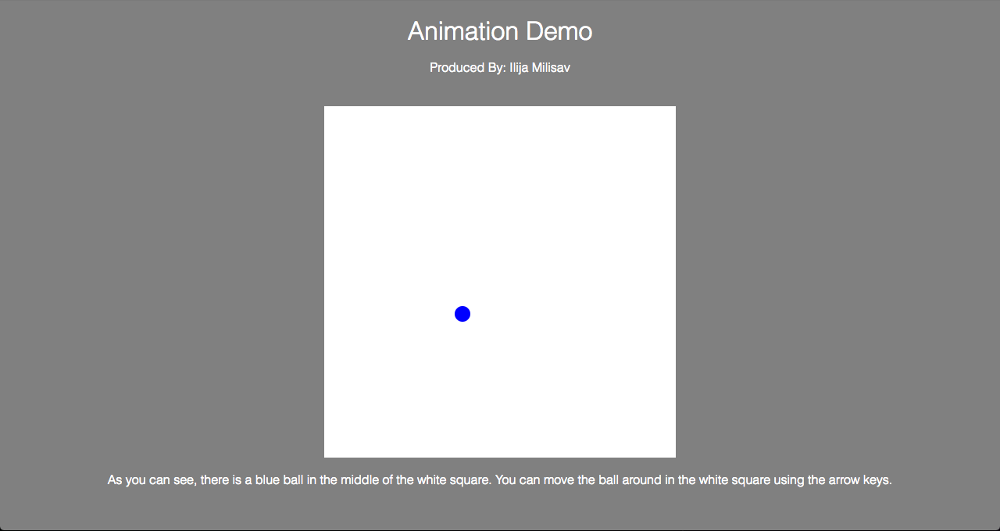

# JavaScript Animation
A small animation created by using the canvas element in HTML.
I manipulated it using JavaScript, embedded in the HTML.
Styled with CSS, also embedded within the HTML.

This opens many opportunities to further my skills in animation, such as games or displaying information in a unique way.
Although at the time being, I do wish to continue and explore JavaScript and see what it can do.

A future endeavour could be creating a game with canvas.

The webpage looks something like: 

